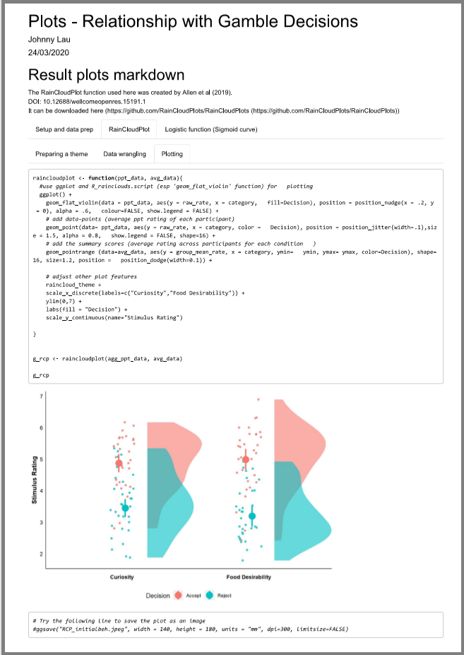

The codes in this repository (the .rmd Markdown file) were used to create the behavioural graphs in the paper, "Shared striatal activity in decisions to satisfy curiosity and hunger at the risk of electric shocks" (doi: https://www.nature.com/articles/s41562-020-0848-3), published in Nature Human Behaviour.

The Markdown file (.rmd) generates the graphs and model summary in <a href="https://johnny.kinglau.info/dataviz_examples/" target="_blank"> an interactive html output </a>, for better visualisation. This includes a 'raincloud plot' illustrating the relationship between the level of curiosity/food desirability and participant's risk-take decisions.

  

The Sigmoid curve (logistic function) models the relationship between the prospective shock probability and participant's risk-take decisions.

  

To see the interactive html outputs generated from the Markdown, click <a href="https://johnny.kinglau.info/dataviz_examples/" target="_blank"> here </a>.
I have also created an ShinyApp (<a href="https://johnnykl-rshiny.shinyapps.io/curidecisionplot-app/" target="_blank"> curidecisionplot-app </a>) as a mini side project for visualisation of data from different experiments in this project.
  
  
#### Remarks:
For the main data repository of this study, please check the corresponding project on OSF: https://osf.io/mafe3/

Neuroimaging data associated with the project: The unthresholded SPM maps can be found under this Neurovault collection https://neurovault.org/collections/AWZZIZCZ/ .

#### The raincloud-plot was created by these guys. Check them out!
Allen M, Poggiali D, Whitaker K et al. Raincloud plots: a multi-platform tool for robust data visualization [version 1; peer review: 2 approved]. Wellcome Open Res 2019, 4:63. DOI: 10.12688/wellcomeopenres.15191.1

Allen M, Poggiali D, Whitaker K, Marshall TR, Kievit R. (2018) RainCloudPlots tutorials and codebase (Version v1.1). Zenodo. http://doi.org/10.5281/zenodo.3368186
