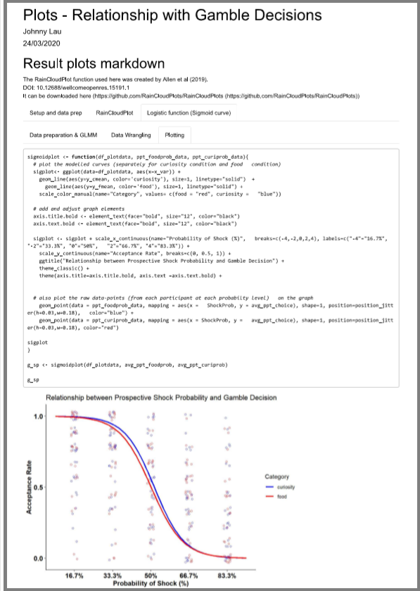

The codes in this repository (the .rmd Markdown file) were used to create the behavioural graphs in the paper, "Shared striatal activity in decisions to satisfy curiosity and hunger at the risk of electric shocks" (doi: https://doi.org/10.1101/473975), published in Nature Human Behaviour.

The Markdown file (.rmd) generates the graphs and model summary in a html file for better visualisation. This includes a 'raincloud plot' illustrating the relationship between the level of curiosity/food desirability and participant's risk-take decisions

The Sigmoid curve (logistic function) models the relationship between the prospective shock probability and participant's risk-take decisions

To see the interactive html outputs, check <a href=https://johnny.kinglau.info/dataviz_examples/" target="_blank"> here </a>
  
Remarks:
For the main data repository for this study, please check the corresponding project on OSF: https://osf.io/mafe3/

Neuroimaging data associated with the project: The unthresholded SPM maps can be found under this Neurovault collection https://neurovault.org/collections/AWZZIZCZ/
